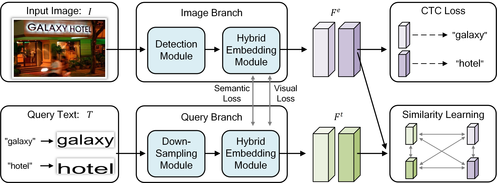

# Visual and Semantic Guided Scene Text Retrieval

The project is based on the source code of maskrcnn-benchmark (https://github.com/facebookresearch/maskrcnn-benchmark) and TDSL (https://github.com/lanfeng4659/STR-TDSL.).

Next I will talk about how to set up the environment, test, train and visualize.

## 1. Build the environment
   1) My cuda version is 10.0 and I don't know if other versions will be compatible.
   2) conda create -n xxx python=3.7.0
   3) conda activate xxx
   4) pip install -r requirement.txt
   5) unzip 6af....zip (apex)
   6) cd apex...
   7) python setup.py install
   8) cd vsstr
   9) python setup.py bulid develop
## 2. For Testing (It's a must before training.)
   1) Download the trained model.
   2) cd tools
   3) python test_net.py --ckpt **.pth --congif-file **.yaml --gpu 0 --dataset s(svt)/c(coco-text)/t(total-text)/3(iiit-str)/h(csvtr)/i(icdar-mlt)(retrieval multilingual)
   4) A *.json file will be generated in the RR_*dataset folder in the current directory, which is necessary for the visualization.
## 3. For Training
   1) CUDA_VISIBLE_DEVICES=0,1,2,3 python -m torch.distributed.launch --nproc_per_node=4 --master_port 10818 train_net.py --config-file ./_vsstr_/train.yml --batch-size 12 --save-dir ./_vsstr_/1124pret --weights ./_visual_/model_00xx000.pth --fps 3 --eng
   
   2) CUDA_VISIBLE_DEVICES=0,1,2,3 python -m torch.distributed.launch --nproc_per_node=4 --master_port 10818 train_net.py --config-file ./_vsstr_/train.yml --batch-size 12 --save-dir ./_vsstr_/1124pret --weights ./_visual_/model_00xx000.pth --fps 3 --mlt
   
   3) CUDA_VISIBLE_DEVICES=0,1,2,3 python -m torch.distributed.launch --nproc_per_node=4 --master_port 10818 train_net.py --config-file ./_vsstr_/train.yml --batch-size 12 --save-dir ./_vsstr_/1124pret --weights ./_visual_/model_00xx000.pth --fps 3 --ch 1|3
   
